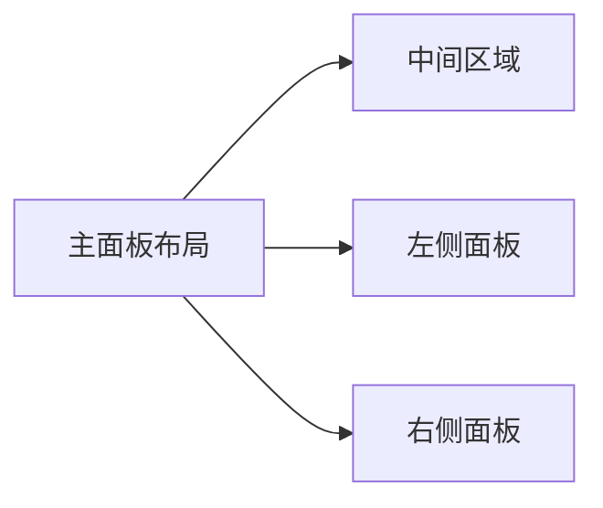

# 计算机考研信息分析与推荐系统需求文档

## 系统重点

**可视化** | **智能推荐** | **计算机考研专项**

---

## 一、客户端需求

### 1. 用户信息管理

- **用户注册/登录系统**
- **个人信息录入**：
  - 学历背景
  - 报考专业领域
  - 目标所在地（A区/B区）
  - 期望院校层级（985/211/双一流/一般）
  - 预期初试分数
- **偏好设置存储**

### 2. 可视化主面板

**动态展示计算机考研核心数据**：



#### （1）中间区域

- **院校滚动列表**：

  ```csv
  院校名称,院校等级,计算机等级,24招生人数,初试科目,所属考区
  ```

#### （2）左侧面板

- **国家线趋势图**：
  - 左上角：计算机考研总分国家线折线图（近3年）
  - 左中：政治国家线柱状图（近3年）
  - 左下：英数国家线折线图（4条色线区分科目）

#### （3）右侧面板

- **数据分布**：
  - 右上：自命题/408统考比例饼图
  - 右中+右下：考研公告通知模块（支持后端更新）

#### （4）功能导航

- **院校库按钮**：

  ```python
  # 查询参数
  search_params = ["地区", "院校等级", "院校名称", "计算机等级"]
  # 结果展示
  result_columns = ["院校名称", "等级", "计算机等级", "招生人数", "收藏量"]
  ```

  - 院校详情页要素：
    - 学校简介
    - 招生院系架构
    - 专业代码对照表
    - 3年复试线趋势图（四川院校）

- **推荐系统按钮**：

  ```math
  推荐评分 = 0.4*分数相似度 + 0.2*院校等级分 + 0.2*计算机等级分 + 0.2*地区匹配分
  ```

  - 权重算法说明：

    | 指标 | 权重 | 评分规则 |
    |---|---|---|
    | 目标分数 | 40% | 误差绝对值计算 |
    | 院校等级 | 20% | 985=60, 211=40... |
    | 计算机等级 | 20% | A+=100, A=80... |
    | 地区匹配 | 20% | 全匹配=100 |

### 3. 交互功能

- **院校收藏系统**：❤️空心→❤️🔥实心收藏
- **详情页导航**：支持20条推荐结果跳转

---

## 二、管理端需求

### 后台管理模块

1. **用户管理**：
   - 账户权限控制
   - 用户行为日志

2. **院校数据库**：
   - 爬虫管理（重点）

   ```python
   # 爬虫配置示例
   crawler_config = {
       "target_url": "院校招生网",
       "data_fields": ["招生人数", "复试线", "专业目录"]
   }
   ```

3. **系统管理**：
   - 轮播图配置
   - 公告分类管理
   - 系统日志监控

4. **管理员中心**：
   - 账户信息维护

### 2. 管理端功能

## 爬虫模块改进建议

根据之前的开发和测试，可以考虑以下几点来增强爬虫模块 (`utils/scraper.py`) 的功能和稳定性：

1. **目标院校扩展**: 继续为 `TARGET_SCHOOLS` 列表中的其他学校（如西南交通大学、成都理工大学等）添加特定的数据抓取和解析逻辑。
2. **选择器健壮性**: 对于不同学校的页面结构差异，尽量使用更具鲁棒性的 CSS 选择器或 XPath 表达式来定位元素，减少因页面微小改动导致的解析失败。
3. **错误处理与日志**:
    - 对网络请求 (使用 `requests` 或 `Selenium`) 增加更完善的异常捕获（如超时、连接错误、状态码检查）。
    - 在数据解析 (使用 `BeautifulSoup`) 过程中，对 `find`、`select` 等操作的结果进行检查，避免对 `None` 对象进行操作。
    - 增加更详细的日志输出，记录关键步骤的成功或失败信息，方便调试。
4. **Selenium 优化**:
    - 考虑在生产环境或非调试模式下使用 Headless 模式运行 Selenium，减少资源消耗。
    - 针对需要动态加载内容的页面，使用更可靠的 `WebDriverWait` 和 `expected_conditions` 来等待特定元素加载完成，而不是固定时间的 `time.sleep()`。
    - 确保 WebDriver 实例在使用完毕后总是能被正确关闭 (`driver.quit()`)，即使在发生异常时也要关闭（例如使用 `try...finally` 结构）。
5. **分数线解析逻辑**:
    - 对于分数线页面，优先通过表格结构提取数据。如果表格结构不规范，再尝试从普通文本中通过正则表达式或关键词匹配提取。
    - 明确区分不同年份、不同学位类型（学硕/专硕）、不同学科门类的分数线，避免混淆。
6. **数据合并逻辑 (`update_school_data`)**: 确保合并逻辑能正确处理新增院系、新增专业、更新现有专业信息（包括分数线）等多种情况，并提供清晰的合并日志。
7. **反爬策略应对**:
    - 加入请求头伪装 (`User-Agent` 等)。
    - 考虑使用代理 IP 池。
    - 在连续请求之间加入随机延时。
8. **代码结构**:
    - 将针对特定学校的解析逻辑封装到独立的函数中，提高代码的可读性和可维护性。
    - 考虑将常量（如目标专业代码 `TARGET_MAJOR_CODES`、目标院系名称关键词等）移到配置文件或脚本顶部，方便管理。

## 其它备注

```甲方原话

重点：可视化，推荐，计算机考研
一． 客户端需求：
1.用户信息填写/账户管理：系统应允许考生录入个人基本信息和考研意向。例如：学历背景、所报考的专业领域、目标所在地、期望院校层次（985，211，双一流，一般）、预期初试分数等。系统支持用户注册登录，保存个人资料及偏好设置，以获得更精准的推荐。
2.登入进去后首先展示的是一个可视化大面板，展示关于计算机考研院校的相关信息的可视化面板，需要具有一定的动态展示，展现出可视化的突出效果。
该面板展示的内容：
(1)一个关于计算机考研院校的滚动列表（列名：院校名称，院校等级，计算机等级，24年招生人数，初试科目，地区（A区和B区的区分））可放在中间
（2）左上角可以做一个近三年来的计算机考研总分的国家线的折线图（鼠标放上去显示具体数据）。
（3）左边中间放政治近3年的国家线的柱状图（鼠标放上去显示具体数据）
（4）左下角做一个英语（1，2）数学（1，2）的国家线走向折线图（4条不同颜色的线）（鼠标放上去显示具体数据）。
（5）右上角放一个计算机院校自命题与408统考的比例的饼状图（鼠标放上去显示具体数据）
（6）右中间和右下角做一个公告通知模块（展示一些学校的24年拟录取名单通告（有数据），或招生信息（可以展示几个）等考研信息的公告通知（通过后端进行上传））
（7）在上面做两个按钮，一个为院校库按钮，点击后这里可以对院校进行查询，查询关键词有：地区，院校等级（985，211，双一流，一般），院校名称，计算机等级。查询输出是列表形式的，展现出学校名称，院校等级，计算机等级，24年招生人数，收藏人数（按收藏人数进行排名）。点击某个想查看具体信息的学校，跳转出该学校的具体信息界面：（包括该学校的简单介绍，学校名称，计算机等级；招生院系；不同院系对应的不同专业及其专业代码，相对应的初试科目，相对应的招生人数，相对应的复试线（四川的需要近三年的数据做线性图）；学费学制）。另一个为推荐按钮，点击该按钮跳转到推荐界面，同样有几个查询窗口（目标分数，目标院校等级，目标院校计算机等级，目标地区{部分数据通过可视化图进行展示}）通过其输入的信息进行推荐算法计算，计算出符合条件的院校进行输出，输出结果也是列表形式（院校等级，计算机等级，24年招生人数，收藏人数），但是排名靠推荐系统，最符合的作为第一个，依次往下输出20个即可。推荐算法可通过加权计算，比如目标分数的相似度占比0.4的权重（相似度可以通过计算误差），目标院校等级的权重为0.2（985分数为60，211为40，双一流为20，一般为0），目标院校计算机等级的权重为0.2（也可以通过计算，假如等级A+为100分，A为80分，A-为70分，B+为60分，B为50分，B-为40分，C+为30分，C为20分，C-为10分，无等级为0分），目标地区权重为0.2（名称一样的为100，不一样的为0）。最后计算出最后结果进行排名。点击想查看的院校进入学校的具体信息界面。
（8）在学校的具体信息界面右上角加上一个空心的爱心的标签，点击后可以转化为红色充满爱心，并且该院校进入到用户的目标院校库中。
二． 管理端需求：
即为后台管理，（1）用户账户管理，（2）院校数据库管理（需要突出爬虫功能，通过关键的url进行爬虫）爬取院校数据，（3）系统管理：轮播图管理；系统日志；公告通知分类；公告通知内容管理。（4）管理员的个人中心：用户名修改，用户名修改。
三． 数据爬取
只用对四川的有计算机考研相关的相关专业的院校进行数据爬取，爬取其近三年的数据。计算机专业涵盖：081200计算机科学与技术，085405电子信息-软件工程，085404电子信息-计算机技术，085400电子信息-计算机技术，085410人工智能，085411大数据技术与工程，083900网络空间安全，083500软件工程
然后全国范围的大部分考研院校数据我有一份，可支持以上所有数据操作。包括院校简介。除了招生信息

```
