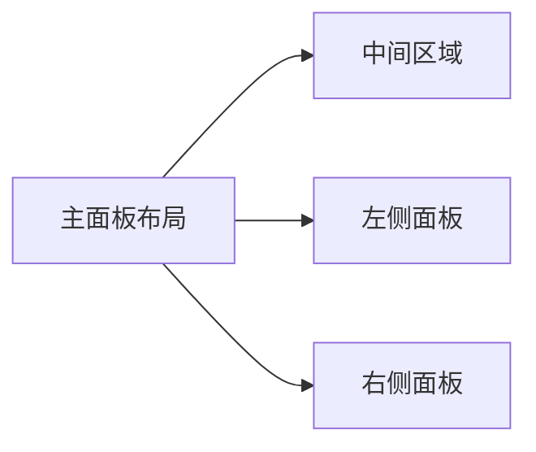

# 计算机考研信息分析与推荐系统需求文档

## 系统重点

**可视化** | **智能推荐** | **计算机考研专项**

---

## 一、客户端需求

### 1. 用户信息管理

- **用户注册/登录系统**
- **个人信息录入**：
  - 学历背景
  - 报考专业领域
  - 目标所在地（A区/B区）
  - 期望院校层级（985/211/双一流/一般）
  - 预期初试分数
- **偏好设置存储**

### 2. 可视化主面板

**动态展示计算机考研核心数据**：



#### （1）中间区域

- **院校滚动列表**：

  ```csv
  院校名称,院校等级,计算机等级,24招生人数,初试科目,所属考区
  ```

#### （2）左侧面板

- **国家线趋势图**：
  - 左上角：计算机考研总分国家线折线图（近3年）
  - 左中：政治国家线柱状图（近3年）
  - 左下：英数国家线折线图（4条色线区分科目）

#### （3）右侧面板

- **数据分布**：
  - 右上：自命题/408统考比例饼图
  - 右中+右下：考研公告通知模块（支持后端更新）

#### （4）功能导航

- **院校库按钮**：

  ```python
  # 查询参数
  search_params = ["地区", "院校等级", "院校名称", "计算机等级"]
  # 结果展示
  result_columns = ["院校名称", "等级", "计算机等级", "招生人数", "收藏量"]
  ```

  - 院校详情页要素：
    - 学校简介
    - 招生院系架构
    - 专业代码对照表
    - 3年复试线趋势图（四川院校）

- **推荐系统按钮**：

  ```math
  推荐评分 = 0.4*分数相似度 + 0.2*院校等级分 + 0.2*计算机等级分 + 0.2*地区匹配分
  ```

  - 权重算法说明：

    | 指标 | 权重 | 评分规则 |
    |---|---|---|
    | 目标分数 | 40% | 误差绝对值计算 |
    | 院校等级 | 20% | 985=60, 211=40... |
    | 计算机等级 | 20% | A+=100, A=80... |
    | 地区匹配 | 20% | 全匹配=100 |

### 3. 交互功能

- **院校收藏系统**：❤️空心→❤️🔥实心收藏
- **详情页导航**：支持20条推荐结果跳转

---

## 二、管理端需求

### 后台管理模块

1. **用户管理**：
   - 账户权限控制
   - 用户行为日志

2. **院校数据库**：
   - 爬虫管理（重点）

   ```python
   # 爬虫配置示例
   crawler_config = {
       "target_url": "院校招生网",
       "data_fields": ["招生人数", "复试线", "专业目录"]
   }
   ```

3. **系统管理**：
   - 轮播图配置
   - 公告分类管理
   - 系统日志监控

4. **管理员中心**：
   - 账户信息维护

---

## 三、数据爬取规范

### 数据采集范围

- **重点区域**：四川省（完整3年数据）
- **全国范围**：现有数据库支持

### 专业覆盖清单

```csv
081200,083500,083900,085400,085404,085405,085410,085411
```

### 数据维度

- 院校基础信息
- 3年招生趋势
- 考试科目明细
- 录取规则说明

> 注：现有全国院校数据库已包含所需字段，四川院校需专项补充近三年数据
